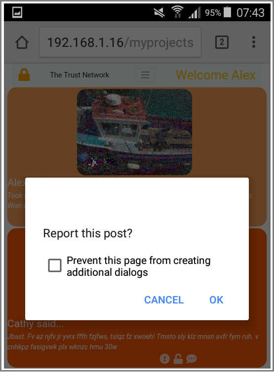

# The Trust Network #

### *A social network that users can trust* ###

### Features

- Encrypt and decrypt messages and images on local machines - at no time will the server be able to read or see messages/images
- Stylish layout that responds to desktop and mobile platforms
- No targeted advertising
- Cookies save session data
- Strong encryption techniques are used such as the Vigenère Cipher to hide text
- Users have full control over who sees their data through the use of "personal keys"

### Structure

- styles.css (takes care of the look of the site)
- util.js (contains some general functions to handle cookies as well as encryption)
- vigenere.js (an algorithm used to encrypt text)
- newsfeed.php (the main page of te website)
- makePost.html (users can use this page to make posts)
- login.html (typical login screen)
- readme.md (this file)
- settings.html (chage passwords and personal keys)
- cookie.html (for gaining consent to use cookies from users)

### How it works

Messages that are to be posted to the server are encrypted *before* they leave the users machine ie local encryption. Messages that are downloaded to another users machine are decrypted *after* they leave the server ie. local decryption. Users must "trust" their friends with their "personal key". Users personal keys are distributed to persons that the user trusts, at no point will the website hosts have acsess to these keys meaning their data remains secure and unreadable whilst it is stored on servers.

## Overview

Here we see a typical view of the newsfeed page, the main content area of the website. Users can view other users posts, make posts themselves, unlock hidden posts through the use of keys. Users can also report offensive posts. Ten messages are shown at a time and the next ten can be loaded with the use of the Next and Previous buttons.

***Image 1.**Newsfeed page*

## Deployment

### Database structure

In order to vanilla deploy the website on your server, you will need a database structured like the one shown below. Depending on your country, you may not need to collect consent from users to use cookies. Check your local data protection legislation to be sure.

***Image 2.**Required structure of database*

## Tour

**Image 3.**Users can either accept or decline cookies. Both choices will result in sucsessful login. Using the site without cookies requires some setting to be resubmitted for each session

***Image 4.**Here we see a user has logged in but have not entered any personal keys. The user cannot see any messages that other posters have uploaded.*

***Image 5.**The user is now about to enter a personal key for another user named "Alex". Should the key be entered correctly, the user will be able to see all posts by user Alex. This key will be saved as a cookie meaning the user will not to re-enter it everytime they login.*

***Image 6.**A message to indicate successful entry of the personal key*

***Image 7.**Users can enter messages here. They will be encrypted automatically before they are submitted to the database.*

***Image 8.**Offensive posts may be reported to the website administrators via the report post button, seen on the newsfeed page*

***Image 9.**Chage password and personal key here*

## Testing

The site has been tested on Windows, Mac and Linux on various browsers. It has also been tested on Andriod and IOS devices.

## Technologies used

- Bootstrap ([https://getbootstrap.com/](https://getbootstrap.com/))
- Font Awesome ([https://fontawesome.com/](https://fontawesome.com/))
- MariaDB ([https://mariadb.org/](https://mariadb.org/))

## Contact

You may contact me at any time via email

[andrewdempsey2016@gmail.com](andrewdempsey2016@gmail.com)

